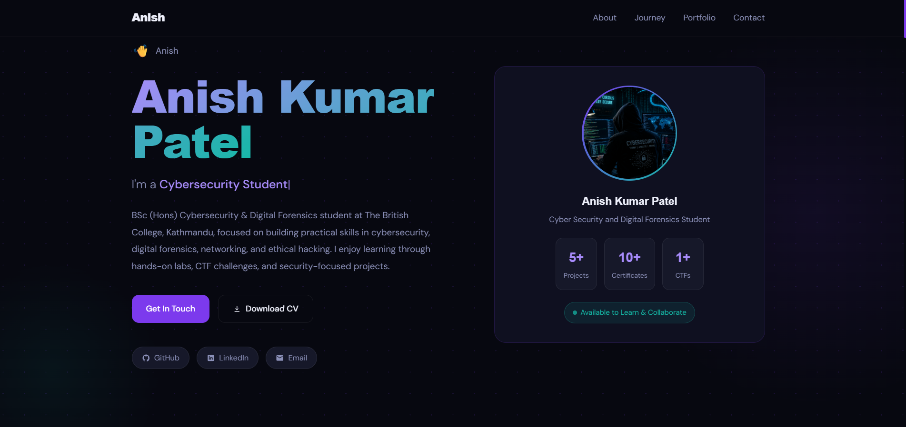
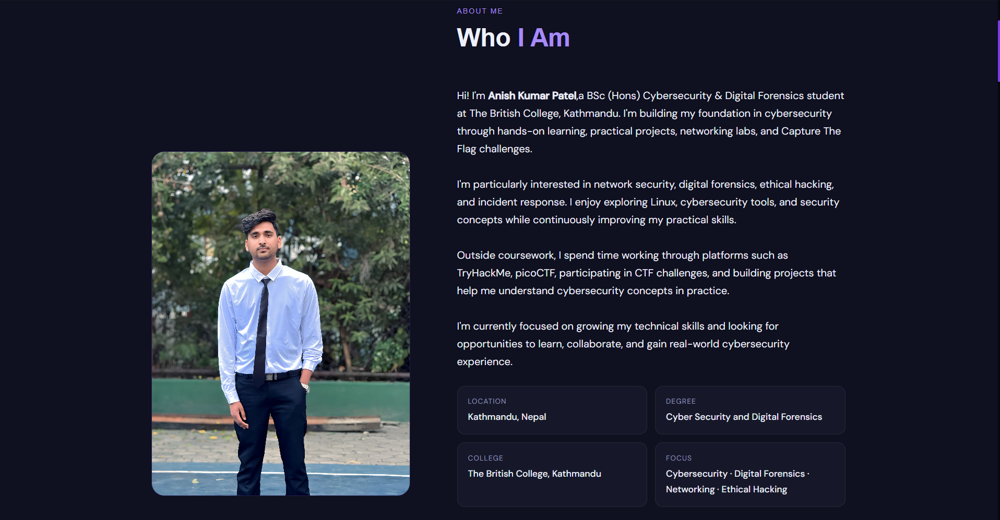
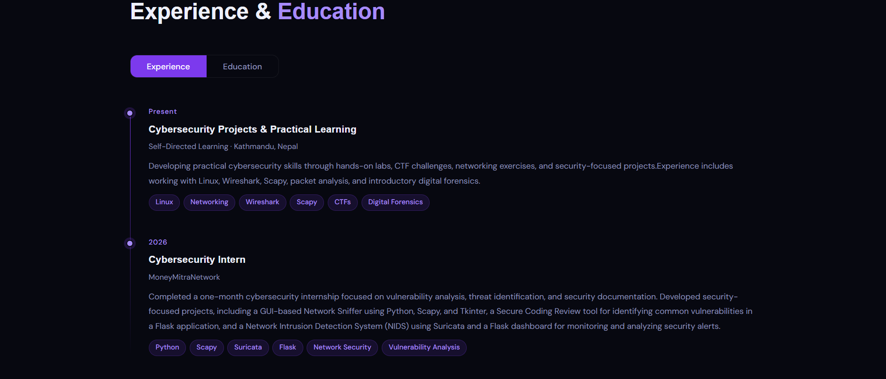
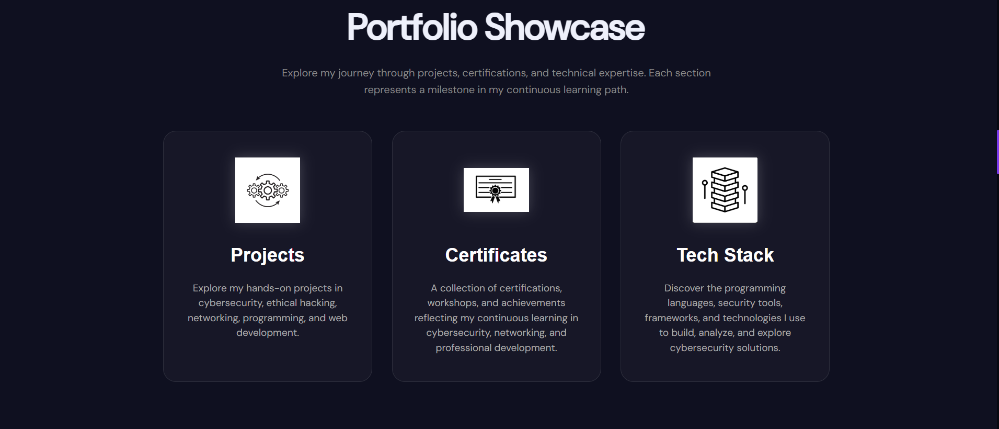
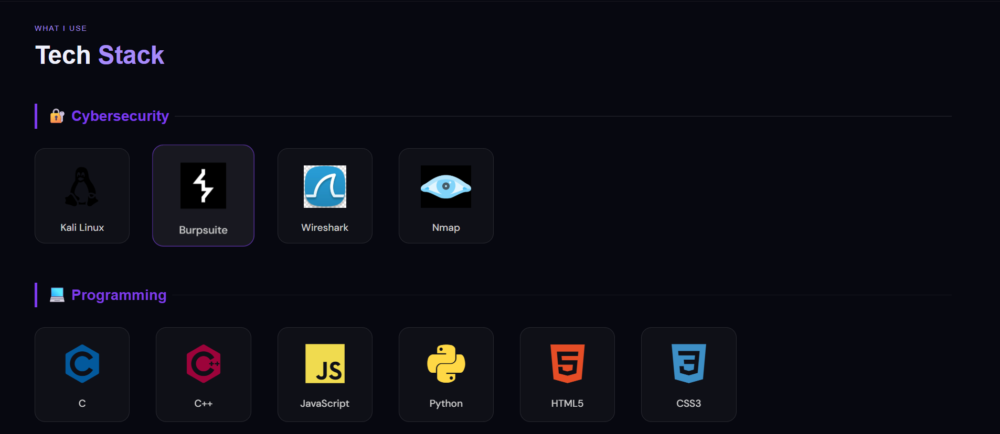
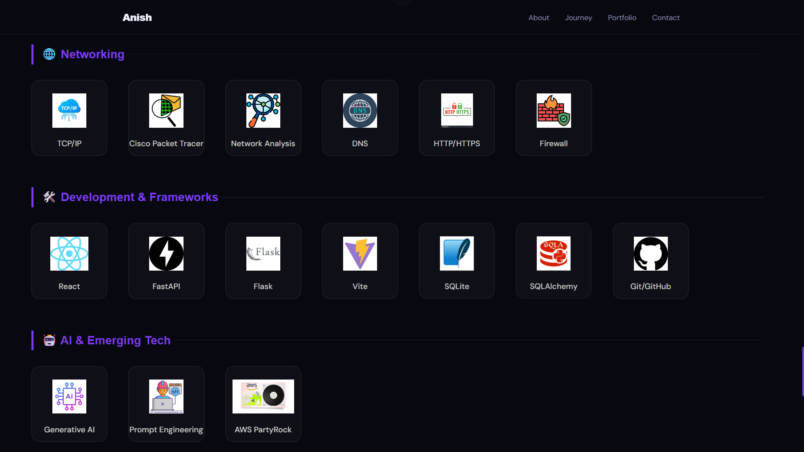
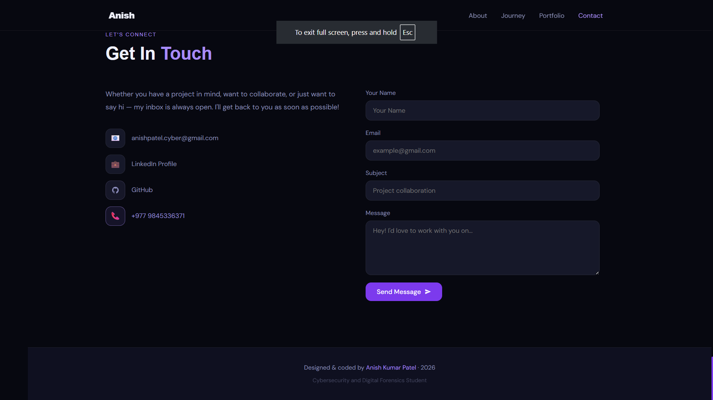

# Anish Kumar Patel — Cybersecurity Portfolio

My personal portfolio website showcasing my cybersecurity journey,
technical skills, projects, certifications, and professional interests.

## 🌐 Live Portfolio

<a href="https://anishkumarpatel.netlify.app/" target="_blank" rel="noopener noreferrer">Visit My Portfolio</a>

## 👨‍💻 About

I am a Cybersecurity & Digital Forensics student with an interest in
ethical hacking, penetration testing, network security, and digital forensics.

This portfolio represents my learning journey, hands-on projects,
certifications, and technical skills.

## 🚀 Featured Projects

- EliteEdge Student Management System
- Technova Website
- Secure Coding Review
- Basic Network Sniffer

## 🛠️ Tech Stack

### Cybersecurity
- Kali Linux
- Burp Suite
- Nmap
- Wireshark

### Programming
- Python
- C
- C++
- JavaScript

### Web & Backend
- HTML
- CSS
- React
- FastAPI
- Flask

### Database
- SQLite
- SQLAlchemy

### Tools
- Git
- GitHub
- Cisco Packet Tracer

## 📜 Certifications

The portfolio includes certifications and learning achievements
from organizations such as Cisco, EC-Council, OPSWAT, HP LIFE,
HubSpot Academy, and others.

## 📱 Responsive Design

The portfolio is designed to work across:

- Desktop
- Tablet
- Mobile

## ✨ Features

- Responsive design
- Cybersecurity-themed UI
- Project showcase
- Certificate showcase
- Technical skills / tech stack
- Social links
- Contact section
- Animated elements
- Dark cybersecurity aesthetic

## 🧰 Technologies Used

- HTML5
- CSS3
- JavaScript
- Devicon
- Netlify

## 📸 Screenshots

## 📬 Contact

**Anish Kumar Patel**

- Portfolio: https://anishkumarpatel.netlify.app/
- GitHub: https://github.com/anishpatel-cyber
- LinkedIn: https://www.linkedin.com/in/anish-kumar-patel-234347382/

## 📄 License

This project is for personal portfolio and educational purposes.

---

Designed & developed by **Anish Kumar Patel** 🇳🇵